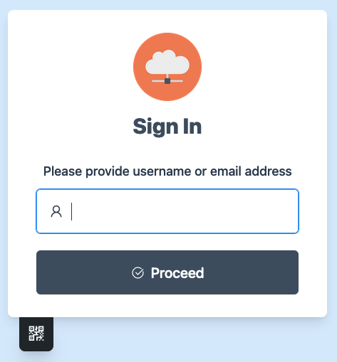

# 验证网关

## 前言

YukiGeek所有的工具，均需要你持有正常的YukiGeek通行证才能正常登陆与使用。

## 登录到页面

当你打开任意一个YukiGeek工具时，在没有登录的情况下，便会跳转到登录页面。

<figure><figcaption>
登录窗口
</figcaption></figure>

在弹出的文本框中输入你的用户名，之后，输入你的密码，即可跳转至工具。

## 有效期

单次登录提供60分钟的有效期。当你发现页面无法正常加载时，请刷新你的页面。

如果你的登录失效，将会重新跳转至鉴权页面。
